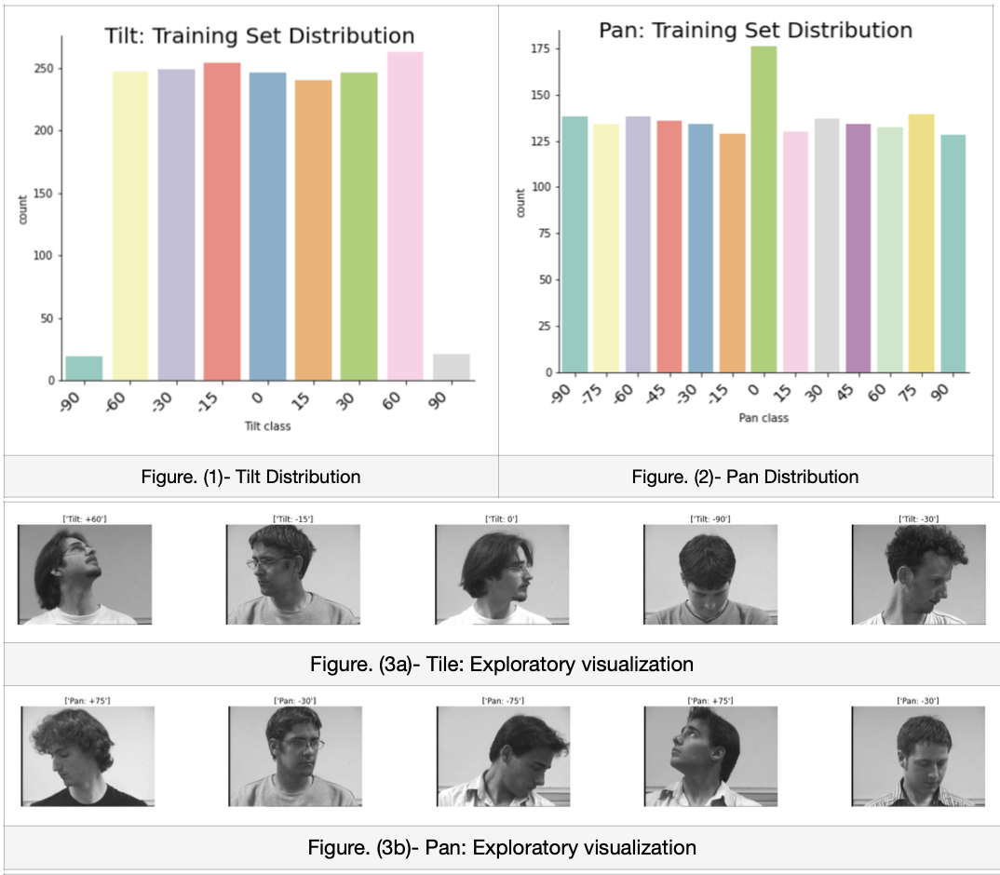
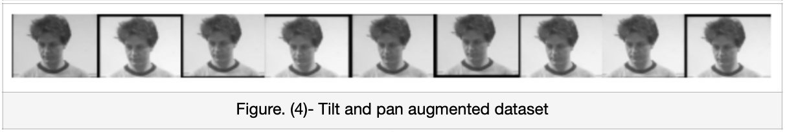
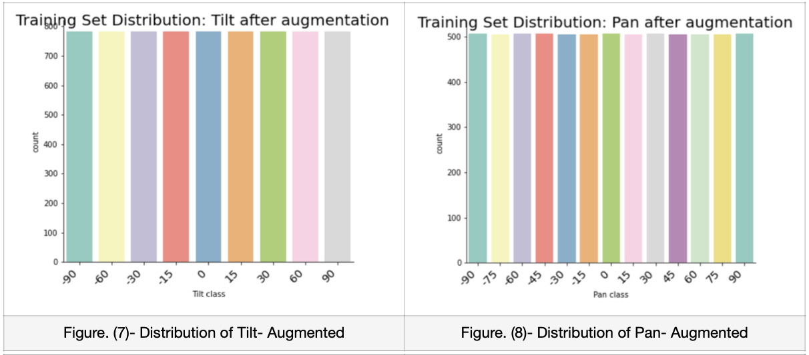
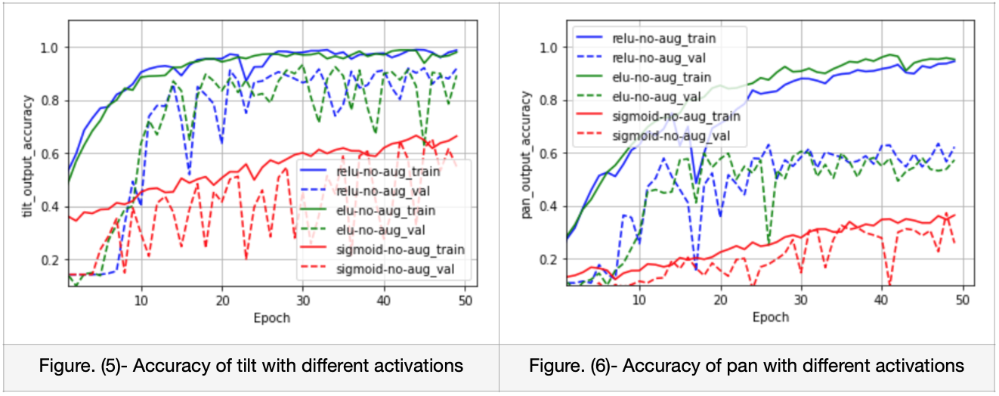
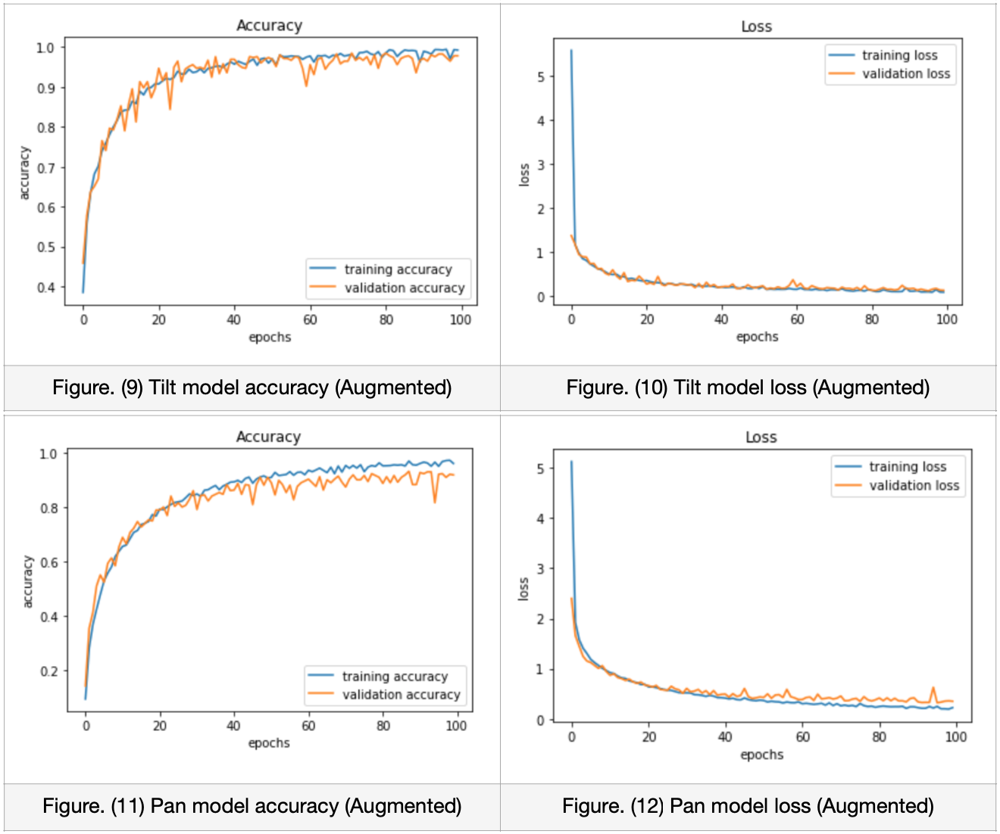

# Head Pose Estimation CNN

## Notebooks:

- [Multi-model-headpose-cnn.ipynb](https://github.com/parekhjigar/Head-pose-estimation-cnn/blob/master/CNN-models/Multi_model_head_pose_estimation_cnn.ipynb)

- [Tilt-model-headpose-cnn.ipynb](https://github.com/parekhjigar/Head-pose-estimation-cnn/blob/master/CNN-models/Tilt_model_headpose_cnn.ipynb)

- [Pan-model-headpose-cnn.ipynb](https://github.com/parekhjigar/Head-pose-estimation-cnn/blob/master/CNN-models/Pan_model_headpose_cnn.ipynb)

## Dataset

The Dataset used is modified version of the data available at: [Head Pose Image Database](http://www-prima.inrialpes.fr/perso/Gourier/Faces/HPDatabase.html)

The head pose database is a benchmark of 2790 monocular face images of 15 persons with variations of pan and tilt angles from -90 to +90 degrees. For every person, 2 series of 93 images (93 different poses) are available. The purpose of having 2 series per person is to be able to train and test algorithms on known and unknown faces (cf. sections 2 and 3). People in the database wear glasses or not and have various skin colour. Background is willingly neutral and uncluttered in order to focus on face operations.

The image dimensions are [192,144]

**Tilt (Vertical angle)** = {-90, -60, -30, -15, 0, +15, +30, +60, +90},  
Negative values - bottom, Positive values - top.

**Pan (Horizontal angle)** = {-90, -75, -60, -45, -30, -15, 0, +15, +30, +45, +60, +75, +90},  
Negative values - left, Positive values - right.

## Files:

- `modified_data`: Contain all the images (test and train set).

- `train_data.csv`: Contain files names of the train set, person id, sequence id for each person, ground truth tilt and pan angles.

- `test_data.csv`: Contain files names of the test set, person id, sequence id for each person.

## 1. Abstract
The purpose of this project and report is to apply various convolutional neural network algorithms and build a Deep Learning Model which is capable of estimating Head Pose of a person from monocular face images which is quantified by Tilt: Vertical angle of the head and Pan: Horizontal angle of the head. Since, there are 9 different angles for tilt and 13 different angles for pan, I decided to consider these values to be fixed classes rather than continuous values as we are required to get exact classes of angles rather than a range of angle and hence chose classification over regression. I applied two different approaches to build the models. Firstly, I implemented a multi-output model which is capable of predicting class labels for each head, i.e. tilt and pan. Secondly, I implemented two different models for tilt and pan respectively.

## 2. Data Exploration

### 2.1. Loading the dataset:

The head pose dataset provided has 2790 monocular face images of 15 persons with variations of tilt and pan angles from -90 to +90 degrees (1). Every person has 2 series of images wherein some people wear glasses or not and have various skin colours and each series has 93 different poses/images of a particular person which would later help the model to give robust predictions on unseen dataset. For the multi-output model, I have considered labels of both tilt and pan along with the images and considered just labels of tilt or pan along with images to train separate single models of each. The shape of the images provided is (192, 144, 3). The tilt has the following 9 classes: {-90, -60, -30, -15, 0, +15, +30, +60, +90}. Meanwhile, pan has the following 13 classes: {-90, -75, -60, -45, -30, -15, 0, +15, +30, +45, +60, +75, +90}

### 2.2. Dataset Preprocessing:

The train_data.csv and test_data.csv has some overlapping data for a same person with different series, i.e. person_id: 3. Hence, to have the final evaluation to be completely unseen and not biased towards that person, I chose to remove 93 images of person_id: 3 from the training dataset and considered that images as manual test data which I will be using for evaluating my final model performance as it would be completely unseen to the model. Here, I’m appending all the image data which is converted into a numpy array along with it corresponding tilt and pan values into a dataframe and converting images to grayscale to reduce the number of channels which will help to reduce the parameters of the model. I pickled out this data so that I can unpick any numpy byte streams whenever the kernel restarts.

### 2.2.1. Normalization:

I have performed data normalization on the images so that the distribution is similar throughout the data. I scaled the images such that it ranges between 0 to 255. In order to bring all pixel values to be positive, each image data values is divided by 255. This leads the model to converge faster while it is training.

### 2.2.2 Splitting data:

The training_dataframe which is pre-processed above, is further shuffled and split operation is performed to get training set and validation set. The actual model is trained using the Training set which consists of 80% of the overall data. Meanwhile, 20% of Validation set gives us biased evaluation of the corresponding trained model. The Manual Test set with person_id: 3 is unseen by the model. This will be used for the final evaluation of the trained model.

### 2.2.3. Distribution of data:

By plotting the histograms to explore the distribution of data, it was clearly noticeable that the training dataset is unbalanced throughout all the classes for both tilt and pan as shown in figure. (1) and (2). In general, this makes the model to be more biased towards the categories having more data leading to incorrect classification and increasing overfitting. So, to evaluate the difference, firstly I trained the models with original unbalanced data. I then perform upsampling and data augmentation on the data to later train with balanced data. Figure. (3a) and (3b) shows the exploratory visualization of dataset.

### 2.2.4. Data Augmentation:

Since the data is unbalanced, data augmentation techniques are applied which helps us to upsample the data and balance it throughout all the classes virtually. This is performed by adding some geometric transformations like changing the colour channels either by adjusting the brightness or contrast. But as I’m already converting the images to grayscale, I haven’t applied any colour transformations. So here the technique that I used is only image translation, wherein the image is shifted with a random amount between -8 and 8 pixels in both the x-axis and y-axis. Techniques like flipping and rotate are not used as it will completely change its angle and it won’t correspond to its label. Figure (4) shows the augmentations performed on the dataset. The balanced distribution is shown in the figure. (7) and (8).

## 3. Model Architecture of CNN
I considered two different approaches to build the CNN models. Firstly I implemented a multi-output model which is capable of predicting class labels for each head, i.e. tilt and pan. Secondly, I implemented two different models for tilt and pan respectively.

### 3.1. Multi-output CNN model

The multi-output architecture consists of two forks wherein each fork is responsible for classification (2). The neural network is split at the beginning into two forks, one for tilt and another for pan respectively and then the fully connected heads are connected at the end of the network. This makes the model to predict a set of labels for each fork which is even capable of predicting disjoint label combinations.
I have followed a generic approach to design the CNN for both the forks. Starting with the input layer, the images with input shape (192, 144, 1) is put into the model. Then, I have added 5 convolutional layers for both forks with different number of filters with different kernel sizes and used batch normalization and 25% dropout. After that I used max pooling for each layer which

helped to decrease the spatial size and to decrease the parameters and computations in the network. I was expecting that the overfitting would be reduced by using dropout, but it didn’t affect much on the model, yet I kept it as it reduced the complexity of the model. Now, to overcome overfitting and reduce the generalisation gap, I tried the model with different activation functions as shown in the figure (5) and (6).

Yet, the model’s performance was poor as the data was unbalanced. As the frequency of data for both tilt and pan were different, it was hard to balance the data as upsampling one class of tilt changed the frequency of all other pan classes. Hence, I further implemented individual models for tilt and pan mainly so that I can balance the data throughout all the classes.

### 3.2. Individual CNN models

Here, I have implemented two different CNN models for tilt and pan which follows a similar structure. Firstly, I tried implementing the models with original data and then with augmented data to compare between the two. The input layer here takes the images with input shape (192, 144, 1). Then, I have added 4 convolutional layers for tilt model and 3 convolutional layers for pan model with different number of filters with different kernel sizes and used 25% dropout and max pooling. Dropout was significantly increasing overfitting so I discarded it. Used L2 Regularization with different values and found that the model performs better with larger learning rates. The generalization gap was reduced, hence reducing the overfitting and loss of the models.

## 4. Ultimate judgement

By performing various hyper-parameter tuning and multiple approaches to solve the classification task, I conclude that the individual models performs better than the multi-output model. Here, I considered F1 Score (categorical accuracy) to evaluate between the approaches as the data is not balanced in the initial models. Moreover, I used categorical crossentropy to evaluate the loss for all the models and tried to minimize the loss and generalization gap. So, the individual models of both tilt and pan trained using balanced and augmented data with the higher learning rate (0.25) and ReLU activation function is the best model according to me. Figure (9) and (10) shows accuracy and loss plots for the tilt model and figure (11) and (12) shows accuracy and loss plots for the pan model respectively.

